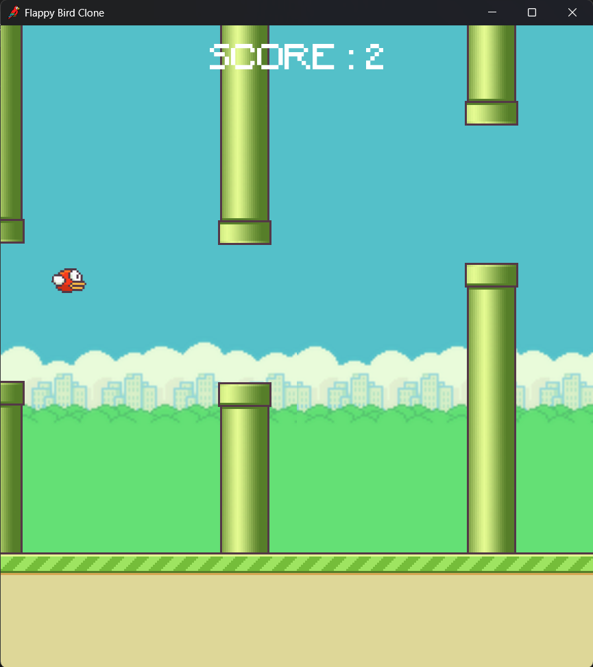
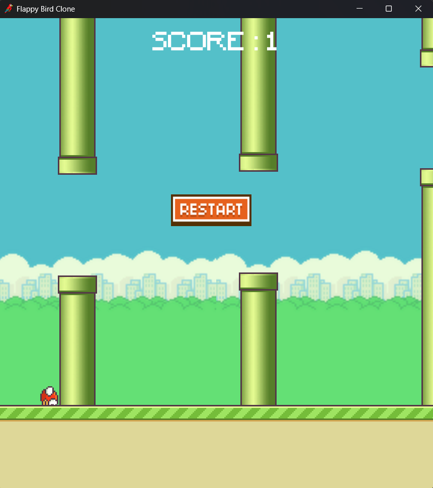

<p align="center">
  
  
  
</p>

# 🐦 Flappy Bird Clone in Godot

A simple Flappy Bird clone created using [Godot Engine](https://godotengine.org/).  
This project is built to practice 2D game development, physics, collision detection, and simple game loops.

## 🚀 Features
- Flappy Bird style gameplay
- Simple click-to-jump physics
- Randomly generated pipes
- Score counter
- Game over & restart functionality

## 🛠 Built With
- **Godot Engine** (version 4.3)
- GDScript

## 📸 Screenshots
<p align="center">
  
  
</p>

## 🚀 Getting Started
### 🔥 Running Locally
1. Clone this repository:
    ```bash
    git clone https://github.com/Salildahiwalkar/Flappy-Bird-Clone.git
    ```
2. Open the project in Godot:
    - Launch Godot.
    - Click **Import**, navigate to the cloned folder, and select the `project.godot` file.

3. Press `Play` ▶ to run the game.

### 📦 Export
- You can export to Windows, Linux, Web, or Android using Godot’s export templates.

## ✍️ Contributing
Feel free to fork this project, open issues, or make pull requests to add improvements like:
- Better graphics & animations
- Sounds and music
- More advanced scoring or levels

## 💡 License
This project is open source under the [MIT License](LICENSE).

## ❤️ Credits
- Inspired by the original [Flappy Bird](https://en.wikipedia.org/wiki/Flappy_Bird).
- Developed by [Salil Dahiwalkar](https://github.com/Salildahiwalkar).

---

🎮 Have fun flapping!
